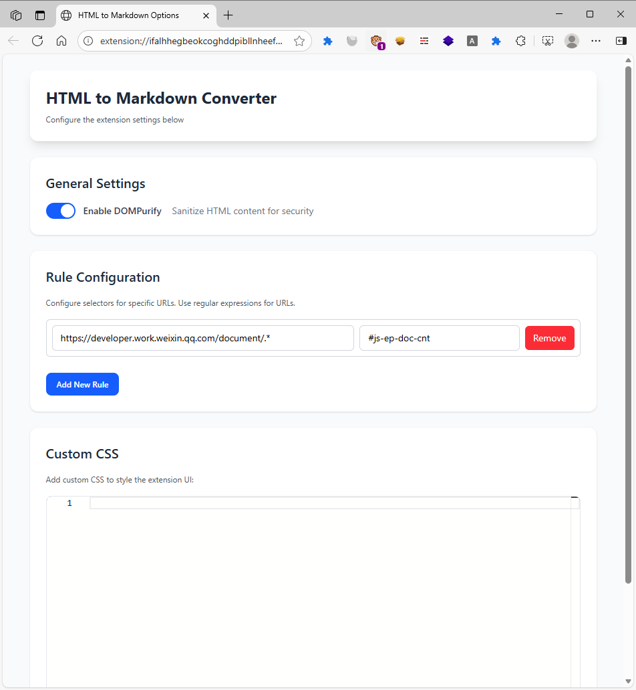
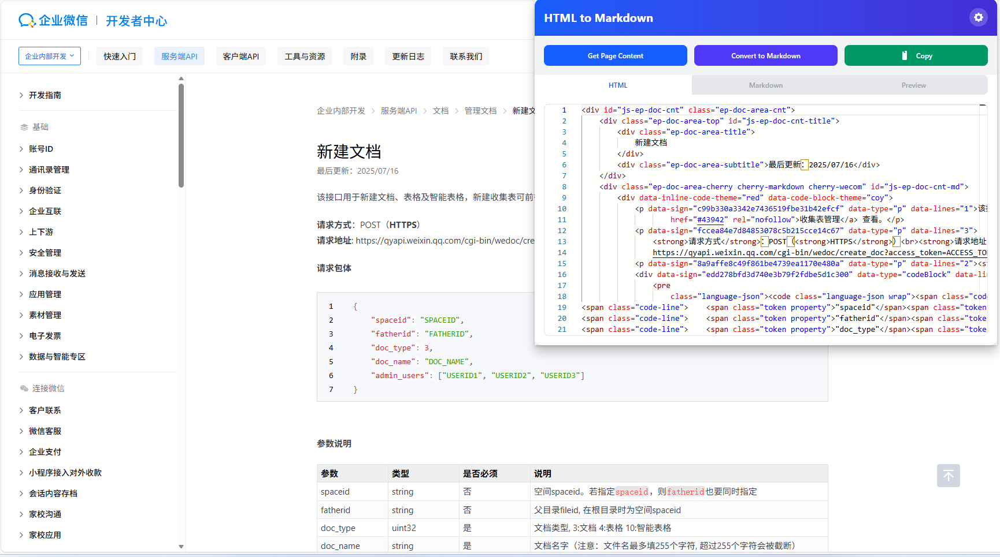
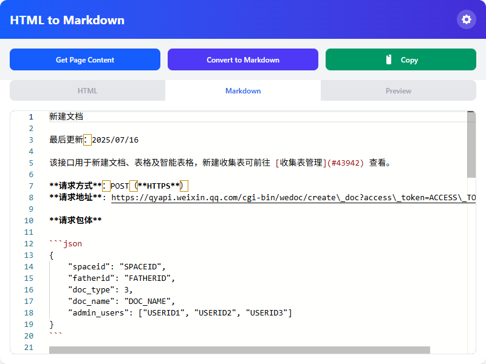
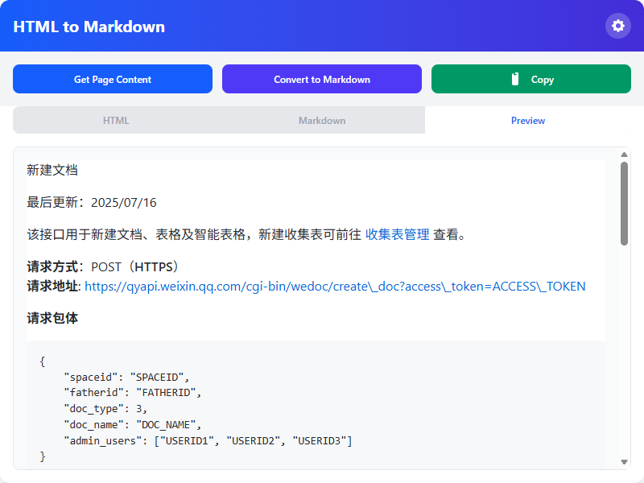

# HTML to Markdown 转换器扩展

[](https://opensource.org/licenses/MIT)

一个功能强大的浏览器扩展，可以将 HTML 内容转换为 Markdown，并具有漂亮的 UI 和高级功能。

## 描述

HTML to Markdown Converter 是一个 Chrome 扩展程序，允许您轻松将任何网页的 HTML 内容转换为 Markdown 格式。借助 Monaco Editor 的强大功能，您可以精确高效地查看、编辑和转换 HTML 到 Markdown。

## 功能

- **HTML 转 Markdown**: 使用 Turndown 将任何 HTML 内容转换为干净的 Markdown
- **Monaco Editor 集成**: 支持语法高亮的 HTML 和 Markdown 富文本编辑
- **实时预览**: 使用 GitHub 样式的实时 Markdown 预览
- **基于 URL 的选择器规则**: 为特定 URL 模式配置自定义 CSS 选择器
- **内容净化**: 可选的 DOMPurify 集成以提高安全性
- **自定义 CSS 编辑器**: 为扩展 UI 添加自定义样式
- **复制功能**: 使用一键复制当前活动选项卡的内容
- **选项卡式界面**: 在 HTML、Markdown 和预览之间无缝切换
- **响应式设计**: 具有 Tailwind 启发的样式的漂亮 UI

## 安装

### 从源码安装

1. 克隆仓库：
   ```bash
   git clone https://github.com/liudonghua123/html_to_markdown.git
   ```

2. 打开 Chrome 并导航到 `chrome://extensions`

3. 在右上角启用"开发者模式"

4. 点击"加载已解压的扩展程序"并选择扩展目录

### 从 Chrome 网上应用店（即将推出）

该扩展程序将在发布后在 Chrome 网上应用店提供。

## 使用方法

### 弹出界面

1. 点击工具栏中的扩展图标以打开弹出窗口
2. 使用"获取页面内容"按钮从当前页面检索 HTML
3. HTML 将以适当的格式显示在 HTML 编辑器选项卡中
4. 点击"转换为 Markdown"以转换 HTML 内容
5. 使用选项卡在 HTML、Markdown 和预览视图之间切换
6. 使用"复制"按钮复制当前活动选项卡的内容

### 选项页面

1. 右键点击扩展图标并选择"选项"或单击弹出窗口中的设置图标
2. 在"常规设置"中打开/关闭 DOMPurify 以提高安全性
3. 在"规则配置"中的特定 URL 添加具有 CSS 选择器的自定义规则
4. 在"自定义 CSS"部分添加自定义 CSS 以设置扩展 UI 的样式
5. 点击"保存选项"以保留更改

## 截图









## 使用的技术

- **Turndown**: HTML 到 Markdown 转换
- **Turndown-plugin-gfm**: GitHub 风格的 Markdown 支持
- **DOMPurify**: HTML 净化以确保安全
- **Marked**: Markdown 解析和渲染
- **Monaco Editor**: 丰富的文本编辑体验
- **GitHub Markdown CSS**: 预览样式
- **Tailwind CSS**: 现代 UI 样式
- **Chrome 扩展 API**: 浏览器集成

## 开发

### 项目结构

```
html_to_markdown/
├── manifest.json              # 扩展清单
├── popup.html                 # 弹出界面
├── popup.js                   # 弹出逻辑
├── popup-editor.css           # 弹出编辑器样式
├── options.html               # 选项页面
├── options.js                 # 选项逻辑
├── options-editor.css         # 选项编辑器样式
├── background.js              # 后台服务工作程序
├── README.md                  # 英文文档
├── README-zh_CN.md            # 中文文档
├── icon*.png                  # 扩展图标
├── vendor/                    # 第三方库
│   ├── @tailwind-browser@4.js
│   ├── turndown.js
│   ├── turndown-plugin-gfm.js
│   ├── dompurify.js
│   ├── marked.js
│   ├── github-markdown-css.css
│   └── monaco-editor/
└── ...
```

### 添加新功能

1. Fork 仓库
2. 创建功能分支 (`git checkout -b feature/amazing-feature`)
3. 进行更改
4. 彻底测试
5. 提交更改 (`git commit -m 'Add amazing feature'`)
6. 推送到分支 (`git push origin feature/amazing-feature`)
7. 开始拉取请求

## 贡献

我们欢迎社区的贡献！以下是一些贡献方式：

### 错误报告

报告错误时，请包含：
- 扩展版本
- Chrome 版本
- 重现问题的步骤
- 期望与实际行为
- 如有必要，请提供截图

### 功能请求

我们一直在寻找改进扩展的方法。在建议功能时：
- 解释使用场景
- 描述它如何使用户受益
- 考虑潜在的实现挑战

### 拉取请求

1. 查看问题跟踪器中现有的请求
2. Fork 仓库并从 `main` 创建分支
3. 遵循现有代码风格
4. 如适用，请添加测试
5. 根据需要更新文档
6. 使用更改的清晰描述打开拉取请求

## 许可证

该项目根据 MIT 许可证授权 - 详见 [LICENSE](LICENSE) 文件。

## 支持

如果您遇到任何问题或有疑问：

1. 查看 [Issues](https://github.com/liudonghua123/html_to_markdown/issues) 页面以获取现有讨论
2. 如果您的问题未得到解决，请打开新问题
3. 尽可能提供详细信息，以帮助我们快速解决您的问题

## 作者

- **liudonghua123** - 初始工作和持续维护

## 致谢

- Monaco Editor 团队提供出色的代码编辑器
- Turndown 团队提供 HTML 到 Markdown 转换
- Marked 团队提供 Markdown 解析
- 开源社区的持续支持

---

为开发者社区 ❤️ 制作。

[](https://opensource.org/licenses/MIT)